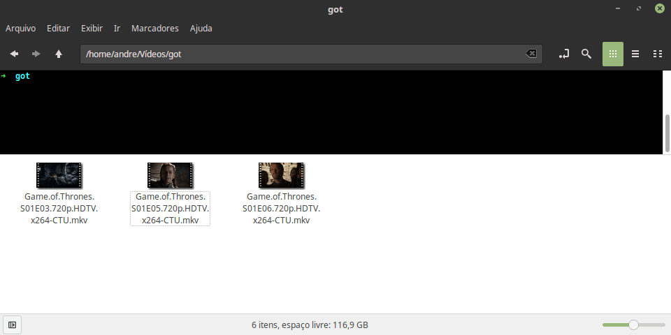

# Download de legendas

Script para download de legendas de filmes e séries.

Consome a [API da SubDB](http://pt.thesubdb.com/api/), que possui uma base de dados gratuíta com milhares de legendas.

Uso: `python3 download_subtitles.py arquivo1.extensao *.extensao etc.*`

Demonstração:

